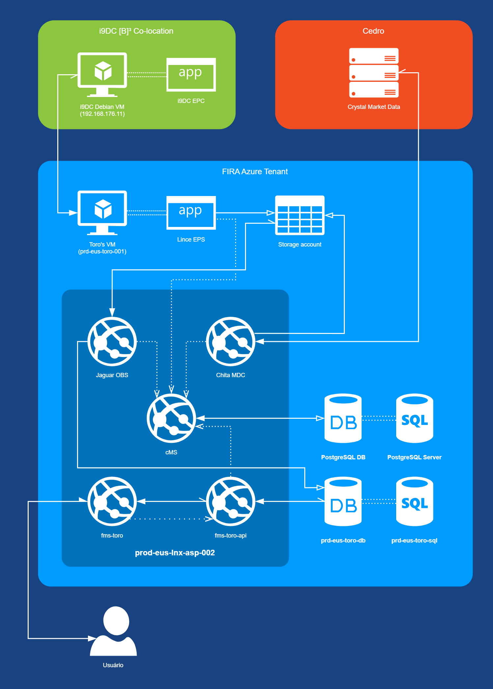

# Documentação do Chita MDC

**Edição**: Rust 2021

## Repositórios relacionados

[EPC](https://dev.azure.com/firaoficial/Portal%20Fira/_git/epc)

[Lince EPS](https://dev.azure.com/firaoficial/Portal%20Fira/_git/lince-eps) 

[Chita MDC](https://dev.azure.com/firaoficial/Portal%20Fira/_git/chita-mdc) <- Você está aqui

[Jaguar OBS](https://dev.azure.com/firaoficial/Portal%20Fira/_git/jaguar-obs) 

[Serval PSS](https://dev.azure.com/firaoficial/Portal%20Fira/_git/serval-pss)

[REPMS] Repo to be pushed

## Contexto do Chita MDC no projeto FIRA Market Surveillance

Este projeto pode ser localizado pela etiqueta `Chita MDC` no diagrama abaixo.



## Preparação do ambiente de desenvolvimento em Linux (Debian ou Ubuntu)

1. Instale o Rust.
    ```
    $ curl --proto '=https' --tlsv1.2 https://sh.rustup.rs -sSf | sh
    $ source $HOME/.cargo/env
    $ rustup toolchain install stable
    $ rustup default stable
    ```
    
3. Depois, crie um Principal para ter acesos ao Azure Key Vault pelo dispositivo de desenvolvimento. Em seguida, execute os comandos abaixo ou adicione-os ao ~/.bashrc.
    ```
    $ export AZURE_CLIENT_ID=<info aqui>
    $ export AZURE_CLIENT_SECRET=<info aqui>
    $ export AZURE_TENANT_ID=<info aqui>
    $ export AZURE_SUBSCRIPTION_ID=<info aqui>
    ```

4. Configure o programa em `/src/helpers/config.rs`. As principais configurações são as seguintes:
    - **INTERVAL**: em produção, deve ser sempre igual a `ChitaInterval::Weekdays`. Para rodar no fim de semana em desenvolvimento, pode ser `ChitaInterval::Everyday`.
    - **START_TIME**: Hora de execução do Chita MDC. Em produção, deve ser sempre 11:00 (UTC+0).
    - **STOP_TIME**: Hora de execução do Chita MDC. Em produção, deve ser sempre 22:00 (UTC+0).

5. Compilação:

    ```
    $ cargo build --release
    ```
6. Execução:
    ```
    $ ./chita-mdc
    ```

## Implantação

TODO